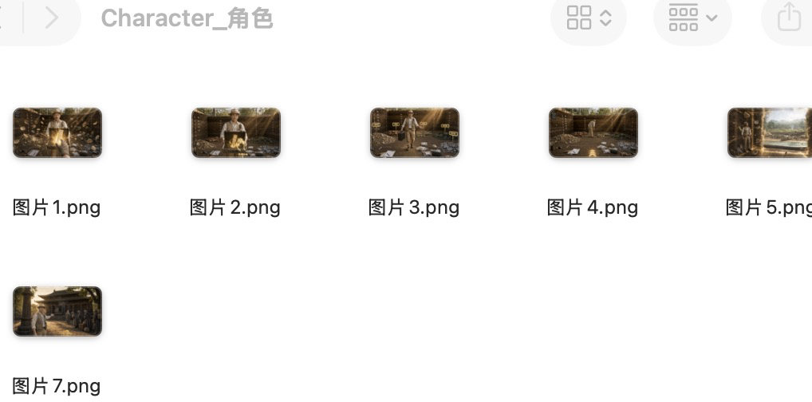
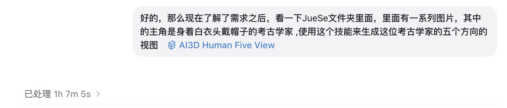
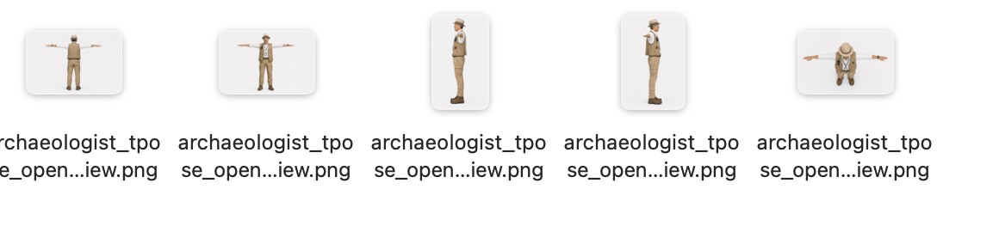
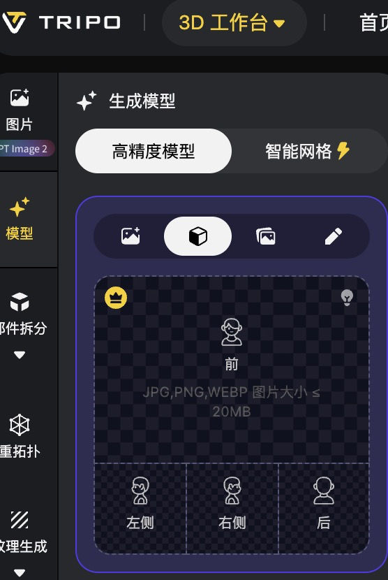
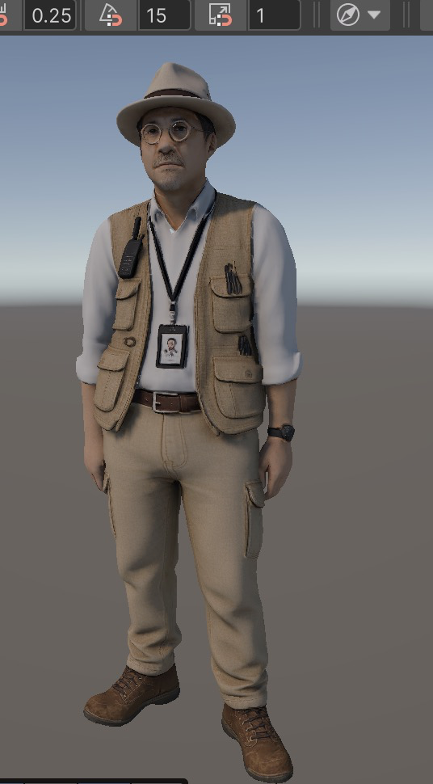

# AI3D 角色与道具参考图工作流

美术与策划操作手册
版本日期：2026-06-24

## 1. 这套工作流解决什么问题

制作 AI3D 模型时，通常不会一开始就有标准正面图、侧面图和背面图。美术或策划手中往往只有一批截图、设定图、电影画面或概念图，其中人物姿态、镜头、光线和遮挡都不一致。

这三个 Skill 的作用是让 Codex 自动完成以下工作：

1. 阅读一个文件夹中的多张参考图片。
2. 从不同图片中提取同一个人物或道具的稳定特征。
3. 把身份特征、造型规则、颜色、材质和禁止偏差写入项目本地文档，长期保存。
4. 根据这些规则生成统一、干净、适合 AI3D 建模的参考视图。
5. 自动把最终视图和过程文件分开整理，便于继续修改和追溯。

最终目标不是生成一张好看的概念图，而是生成一组结构明确、身份一致、能够交给 Tripo、Meshy、Hunyuan3D 等 AI3D 工具使用的建模参考图。

## 2. 只需一句话安装

把下面整句话粘贴给 Codex：

> 请使用 skill-installer 从公开 GitHub 仓库 kaojunn/ai3d-codex-skills 安装 skills/ai3d-human-five-view、skills/ai3d-prop-five-variants 和 skills/ai3d-prop-five-view 三个 Skill；安装完成后检查它们是否已安装到本地，并提醒我重启 Codex。

安装完成后，完全退出并重新打开 Codex。美术和策划不需要自行运行安装命令。

如果 Codex 提示同名 Skill 已经存在，说明电脑上已经安装过。不要直接删除原文件，告诉 Codex：

> 请先备份我本地已经安装的这三个 Skill，再从 kaojunn/ai3d-codex-skills 仓库同步最新版本，完成后检查本地版本并提醒我重启 Codex。

## 3. 三个 Skill 分别什么时候使用

| Skill | 什么时候使用 | 会得到什么 |
| --- | --- | --- |
| `ai3d-human-five-view` | 从一批人物截图或角色设定图制作人物建模参考 | 同一个人物的正面、背面、左侧、右侧、顶面五视图，以及本地角色特征文档 |
| `ai3d-prop-five-variants` | 道具大方向已经确定，但外轮廓和器型还需要选方案 | 一件标准原型和四件同系列造型派生，全部为统一正视图 |
| `ai3d-prop-five-view` | 道具造型已经选定，需要交给 AI3D 生成模型 | 同一个道具的正面、背面、左侧、右侧、顶面五视图，以及本地道具特征文档 |

简单判断：

- 做人物：直接使用 `ai3d-human-five-view`。
- 做道具但造型未定：先使用 `ai3d-prop-five-variants`。
- 已选定道具造型：使用 `ai3d-prop-five-view`。
- 道具完整流程：先生成五个方案，人工选择一个，再生成这个方案的五视图。

## 4. 开始前怎样准备参考图片

### 4.1 每个对象单独一个文件夹

一个人物、一个道具分别建立文件夹，不要把多个角色或多个不同道具混在一起。

推荐示例：

```text
项目文件夹/
  Reference/
    Character_考古学家/
      图片1.png
      图片2.png
      图片3.png
      图片4.png
      图片5.png
    Prop_考古帽/
      图片1.png
      图片2.png
```

文件名不需要非常专业。`图片1.png`、`图片2.png` 也可以，Codex 会阅读图片内容。



图 1：同一角色的不同镜头集中保存在一个文件夹中。

### 4.2 什么图片最有用

尽量提供：

- 正面或接近正面的全身图。
- 左右侧面或明显能看出身体厚度的图。
- 能看到背部、背包、头发后部或服装背面的图。
- 脸部、发型、帽子、眼镜、鞋子等局部清晰图。
- 能看清主色、辅色、花纹和材质的图。
- 对身份非常重要的道具或配件近照。

可以使用有透视、有动作、有遮挡的截图，但不要只提供一张模糊图片。

### 4.3 告诉 Codex 谁才是目标

一张图片中可能有多人或多个物品。任务中必须明确说明：

- 目标人物是谁。
- 目标道具是哪一件。
- 哪些配件属于目标。
- 哪些物品不要生成。

例如：

> 目标是穿白衬衫、米色马甲、戴帽子和圆眼镜的考古学家。背景人物、桌子和场景都不是目标。

## 5. 人物五视图完整操作流程

### 5.1 第一步：把图片交给 Codex

在 Codex 中打开项目文件夹，说明参考图片所在位置、目标人物和输出位置。

可直接粘贴：

> 使用 $ai3d-human-five-view 处理 `Reference/Character_考古学家` 文件夹中的全部图片。目标是穿白衬衫、米色马甲、戴帽子和圆眼镜的考古学家。请先从所有图片中提取并整理人物身份、体型、头身比、脸部、发型、服装层级、配件、颜色和材质特征，把这些规则持久化保存在项目本地参考文档中；我确认特征后，再生成适用于 AI3D 建模的正面、背面、左侧、右侧和顶面五视图，并自动整理输出文件夹。



图 2：在任务中说明目标人物，并明确调用 `AI3D Human Five View`。

### 5.2 第二步：先审查特征文档，不要急着生成

Codex 会综合多张图片，建立本地角色参考文档。文档应至少包含：

- 角色身份和年龄感。
- 高矮胖瘦、头身比和站姿。
- 脸型、眼睛、鼻子、嘴、肤色和表情。
- 发型、帽子、眼镜等头部特征。
- 内层衣服、外层衣服、腰带、裤子和鞋。
- 手表、胸牌、对讲机、工具等配件。
- 主色、辅色、材质和磨损程度。
- 必须保留的身份识别点。
- 绝对不能出现的错误。

这份文档是后续修改和重新生成时的统一规则，不要删除。以后需要修改角色时，应先更新文档，再重新生成图片。

审查时重点问：

- 这个描述能否让没有看过原图的人认出角色？
- 是否把临时光影误认为衣服颜色？
- 是否遗漏帽子、眼镜、胸牌、腰带或标志性道具？
- 是否把背景人物或场景物品写进角色？
- 是否明确了体型和头身比，而不只是描述衣服？

### 5.3 第三步：确认后生成五视图

特征没有问题后，告诉 Codex：

> 特征文档确认。现在严格按照本地角色参考文档生成五视图。五张图必须是同一个人、同一套服装、同一体型和同一比例；使用干净浅色背景，不要场景、文字和水印。人物采用适合建模和绑定的 T-pose，手臂水平展开，腋窝、袖子、上臂和身体不要粘连，手脚和帽子必须完整。



图 3：统一输出的背面、正面、左右侧面和顶面视图。

人物五视图默认使用 T-pose，因为手臂离开身体后更适合 AI3D 识别身体结构，也更方便后续骨骼绑定。只有项目明确需要时才要求 A-pose。

### 5.4 第四步：检查五张图

不要只看脸像不像，应按下面顺序检查：

1. 五张图是否真的是同一个人。
2. 高矮、胖瘦和头身比是否一致。
3. 帽子、脸、眼镜、发型是否一致。
4. 马甲、衬衫、腰带、裤子和鞋是否前后连贯。
5. 配件位置是否一致，有没有随机增加或消失。
6. 左右侧面是否真侧面，而不是斜侧面。
7. 背面是否有完整设计，而不是随意猜测。
8. 顶视图是否真的从正上方观察。
9. 手臂是否水平，腋窝和身体是否分开。
10. 手、脚、帽子是否完整，没有被裁切。

发现错误时，不要接受整组结果。明确告诉 Codex哪一张失败、失败在哪里，并要求只重做该视图。

示例：

> 右侧视图失败：手臂下降，袖子和躯干粘连，而且帽檐比正面更宽。保留已确认的人物特征和其他四张图，只重新生成右侧视图。

### 5.5 第五步：把视图交给 AI3D 工具

AI3D 工具通常要求正面、左侧、右侧和背面。按照界面对应位置上传，不要放错方向。顶面图可作为支持参考；目标平台支持更多视图时再上传。



图 4：Tripo 多视图输入区。正面、左侧、右侧和背面必须对应正确。

上传前再次确认：

- 图片背景干净。
- 角色大小接近。
- 五张图比例一致。
- 没有文字、水印和场景。
- 没有把左侧和右侧放反。

### 5.6 第六步：检查 AI3D 初模



图 5：生成模型进入三维软件或引擎后的检查阶段。

第一轮优先检查结构，不要先纠结最终材质：

- 人物体型和头身比是否正确。
- 脸部轮廓和帽子是否还能识别。
- 马甲、衬衫、裤子和鞋有没有融合。
- 手臂、手掌、手指和腋窝是否可修。
- 背面服装是否与参考一致。
- 配件是否与身体错误融合。

结构错误严重时，应回到特征文档或失败视图重新生成，不要试图只靠贴图掩盖。

## 6. 道具五方案的操作方法

`ai3d-prop-five-variants` 用于“还没有决定最终器型”的阶段。例如花瓶、帽子、箱子、眼镜、工具或科幻设备，需要先比较不同外轮廓。

### 6.1 准备内容

- 只放同一个目标道具的图片。
- 明确道具名称和用途。
- 指出哪些内容不能改变，例如颜色、花纹、材质和磨损。
- 指出希望探索的方向，例如更宽、更矮、底座更厚或把手更圆。

### 6.2 可直接粘贴的任务

> 使用 $ai3d-prop-five-variants 处理 `Reference/Prop_花瓶` 文件夹中的参考图。先提取并持久化保存这个花瓶的类别、用途、颜色位置、花纹、材质、磨损和标志性细节。生成一件标准化原型和四件同系列造型派生。五张图必须保持相同颜色、花纹、材质、视角、比例基准和背景，只允许改变外轮廓、主体比例、曲线或一个主要附属结构。生成后自动整理文件，并制作五方案对比图。

### 6.3 怎样选择方案

选择时优先看：

- 缩小后轮廓是否仍然清楚。
- 是否仍然属于同一种道具。
- 是否满足实际功能。
- 是否只改变了计划中的形状。
- 颜色、花纹和材质有没有漂移。
- 后续是否容易生成背面和侧面。

选定后告诉 Codex：

> 选择 `variant_03` 作为最终造型。请把这个选择写入本地道具参考文档，并把它作为下一步道具五视图的主要正面参考。其他方案不要再影响后续造型。

## 7. 道具五视图的操作方法

`ai3d-prop-five-view` 用于已经确定造型的单件道具。每次只处理一件对象。

允许：

- 一顶帽子。
- 一副眼镜。
- 一个箱子。
- 一件工具。
- 一对作为单一资产的眼睛。

不要混合：

- 帽子和眼镜。
- 箱子和拿箱子的手。
- 眼睛和完整脸部。
- 道具和穿戴它的人物。

### 7.1 可直接粘贴的任务

> 使用 $ai3d-prop-five-view 处理 `Reference/Prop_考古帽` 文件夹中的图片。目标只有考古帽，不要生成头部、脸、头发、人物或场景。先提取并持久化保存帽子的外轮廓、帽顶高度、帽檐宽度和弧度、帽带、内侧开口、材质、颜色、磨损和接触结构；我确认后，再生成正面、背面、左侧、右侧和顶面五视图，并自动整理最终视图和过程文件。

### 7.2 道具五视图检查表

- 每张图中只有目标道具。
- 正面、背面、左侧、右侧和顶面方向正确。
- 宽、高、厚度在不同视图中一致。
- 背面不是空白或随机设计。
- 细小部件没有消失。
- 材质、颜色、花纹和磨损保持一致。
- 没有手、头、人物、桌子或场景。
- 道具完整，没有被图片边缘裁切。

如有必要，可以额外要求底面、内部、爆炸图或安装关系图。这些属于辅助图，不应替代标准五视图。

## 8. Codex 会在本地保存什么

Skill 不只生成图片，还会把过程长期保存在项目中。典型内容如下：

```text
角色或道具参考目录/
  Photos/                 原始参考图片
  Crops/                  Codex 提取的脸、服装、材质等局部图
  GeneratedViews/
    views/                最终确认的五张视图
    support/              提示词、预览图、草稿、总览图和记录
  ModelingReference.md    人物或道具的特征规则文档
```

美术和策划主要关注：

- `ModelingReference.md`：确认目标身份和造型规则。
- `GeneratedViews/views/`：上传 AI3D 的最终图片。
- `GeneratedViews/support/`：出现问题时追查提示词、草稿和对比图。

不要把所有图片重新混在同一个文件夹中，也不要删除已经确认的参考文档。

## 9. 最重要的工作原则

### 9.1 先确认特征，再生成图片

如果人物身份、体型、服装层级或道具结构没有整理清楚，直接生成五视图会造成五张图互相矛盾。

### 9.2 先保造型，再保颜色

AI3D 初模最重要的是体型、轮廓、比例、厚度和部件关系。颜色和材质不能弥补错误结构。

### 9.3 一次只处理一个目标

人物任务只做一个人物。道具任务只做一个道具。复杂角色可以把帽子、眼镜、箱子等拆成单独道具任务。

### 9.4 错一张就只重做一张

如果四张正确、一张错误，不要整组重新生成。明确指出失败视图和失败原因，保留其他结果。

### 9.5 本地参考文档是项目规则

所有重新生成、修改和交接都应以本地参考文档为准，避免不同人员凭聊天记录或记忆判断。

## 10. 常见问题

### Codex 生成了图片，但没有保存到项目中

告诉 Codex：

> 请按照当前 Skill 的输出规范，把最终视图复制到项目的 `views` 文件夹，把提示词、预览图、草稿、总览图和记录整理到 `support` 文件夹，不要只保留在 Codex 临时生成目录。

### 五张图不像同一个人或同一个道具

先回到本地特征文档，检查身份锚点是否明确，再要求所有视图共享同一份身份和风格规则。

### 图片很好看，但 AI3D 模型很差

检查是否存在斜视角、遮挡、比例不一致、手臂贴身体、部件融合、侧面厚度不一致或背面随机等结构问题。

### 人物手臂和身体粘在一起

要求重做失败视图，并明确写出：T-pose、双臂水平、腋窝露出背景、袖子和上臂与躯干分离。

### 道具五方案只是换了颜色

要求锁定全部颜色、花纹和材质，只允许改变器型、轮廓和计划中的几何比例。

### 安装后 Codex 找不到 Skill

完全退出并重启 Codex，然后在新任务中明确写出 `$ai3d-human-five-view`、`$ai3d-prop-five-variants` 或 `$ai3d-prop-five-view`。

## 11. 三句常用指令

人物：

> 使用 $ai3d-human-five-view 从这个参考图片文件夹提取并持久化保存角色特征。我确认特征后，再生成同一角色的正面、背面、左侧、右侧和顶面五视图，最终视图与过程文件分开整理。

道具五方案：

> 使用 $ai3d-prop-five-variants 从这个单一道具参考文件夹提取并保存不变特征，生成一件标准原型和四件只改变几何造型的同系列正视方案，并制作对比图。

道具五视图：

> 使用 $ai3d-prop-five-view 从这个单一道具参考文件夹提取并持久化保存造型规则。我确认后，再生成正面、背面、左侧、右侧和顶面五视图，最终图片中不要出现人物、手或场景。
